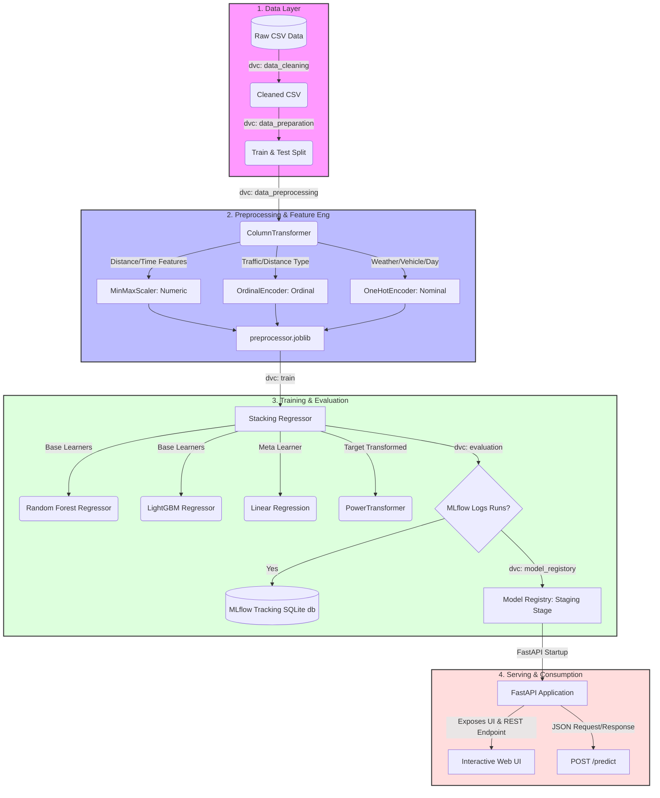

# 🚴 Swiggy Delivery Time Prediction System

[](https://fastapi.tiangolo.com/)
[](https://dvc.org/)
[](https://mlflow.org/)
[](https://scikit-learn.org/)
[](https://www.docker.com/)

An end-to-end, production-grade machine learning system designed to predict food delivery times in minutes. The project leverages **DVC** for pipeline orchestration, **MLflow** for experiment tracking and model registry, and **FastAPI** to serve the predictions through a clean, interactive browser UI.

---

## 🎯 Business Use Case & Value Proposition

In the food tech industry, **Estimated Time of Delivery (ETD)** is a critical driver of customer experience and operational efficiency. Delivering food either too early or unexpectedly late hurts the business.

```
                  ┌───────────────────────────────────────────┐
                  │          Real-time Customer Order         │
                  └─────────────────────┬─────────────────────┘
                                        │ (Rider, Restaurant & Location Metrics)
                                        ▼
                  ┌───────────────────────────────────────────┐
                  │    Swiggy Delivery Prediction Engine      │
                  └─────────────────────┬─────────────────────┘
                                        │ (Predicts exact minutes)
                                        ▼
                  ┌───────────────────────────────────────────┐
                  │         Optimized Dispatch & ETD          │
                  └─────────────────────┬─────────────────────┘
                                        │
             ┌──────────────────────────┴──────────────────────────┐
             ▼                                                     ▼
┌──────────────────────────┐                                ┌──────────────────────────┐
│  For the Customer        │                                │  For the Business        │
│  - Accurate expectations │                                │  - Smart rider dispatch  │
│  - Higher satisfaction   │                                │  - Minimized cold meals  │
│  - Lower support load    │                                │  - Reduced churn rates   │
└──────────────────────────┘                                └──────────────────────────┘
```

### Key Business Metrics Impacted:
*   **Customer Satisfaction & Retention:** Displaying an accurate ETD reduces anxiety and helps manage expectations, which lowers the order cancellation rate.
*   **Rider Dispatch Optimization:** Understanding how long a delivery will take under current weather and traffic conditions helps algorithms batch orders and assign the most appropriate rider.
*   **Operational SLA Compliance:** Businesses can proactively monitor deliveries likely to breach SLAs (e.g., cold food, late arrivals) and implement mitigation steps.


---

## 🏗️ End-to-End System Architecture

This project is built around a rigorous MLOps architecture, ensuring reproducibility from raw data to a running container.



---

## 📊 Pipeline Orchestration (DVC)

We use Data Version Control (DVC) to build a reproducible, state-aware pipeline. The workflow stages defined in [dvc.yaml](file:///d:/Project/swiggy_delivery_time_prediction/dvc.yaml) are:

| Stage | Script | Input Dependencies | Outputs Generated | Description |
| :--- | :--- | :--- | :--- | :--- |
| **`data_cleaning`** | [data_cleaning.py](file:///d:/Project/swiggy_delivery_time_prediction/src/data/data_cleaning.py) | `data/raw/swiggy.csv` | `data/cleaned/swiggy_cleaned.csv` | Cleans raw columns, filters out minor riders and incorrect ratings, extracts features (e.g., time of day, weekend, pickup duration, Haversine distance). |
| **`data_preparation`** | [data_preparation.py](file:///d:/Project/swiggy_delivery_time_prediction/src/data/data_preparation.py) | `data/cleaned/swiggy_cleaned.csv` | `data/interim/train.csv`, `data/interim/test.csv` | Performs a train/test split based on parameters in `params.yaml`. |
| **`data_preprocessing`** | [data_preprocessing.py](file:///d:/Project/swiggy_delivery_time_prediction/src/features/data_preprocessing.py) | `data/interim/train.csv`, `data/interim/test.csv` | `data/processed/train_trans.csv`, `data/processed/test_trans.csv`, `models/preprocessor.joblib` | Applies OneHotEncoding, OrdinalEncoding, and MinMaxScaler scaling, saving the preprocessing pipeline. |
| **`train`** | [train.py](file:///d:/Project/swiggy_delivery_time_prediction/src/models/train.py) | `data/processed/train_trans.csv` | `models/model.joblib`, `models/power_transformer.joblib`, `models/stacking_regressor.joblib` | Trains a **StackingRegressor** combining Random Forest and LightGBM models wrapped in a target regressor. |
| **`evaluation`** | [evaluation.py](file:///d:/Project/swiggy_delivery_time_prediction/src/models/evaluation.py) | `models/model.joblib`, processed train/test datasets | `run_information.json` | Computes Mean Absolute Error (MAE), $R^2$, and 5-fold cross-validation scores, logging metrics and artifacts to MLflow. |
| **`model_registory`** | [registory.py](file:///d:/Project/swiggy_delivery_time_prediction/src/models/registory.py) | `run_information.json` | None (MLflow DB modification) | Registers the run in the MLflow Model Registry and transitions the model version to the `Staging` stage. |

---

## 🤖 Machine Learning Model Details

To capture complex interactions between traffic patterns, rider features, distances, and weather conditions, we implement a stacked regressor architecture:

1.  **Base Regressors:**
    *   **Random Forest Regressor:** Handles non-linear interactions and robustly learns patterns from categorical-heavy branches.
    *   **LightGBM Regressor:** A gradient boosting framework that trains fast and excels on tabular features.
2.  **Meta-Regressor:**
    *   **Linear Regression:** Synthesizes the base estimators' predictions to compute the final food delivery time.
3.  **Target Transformation:**
    *   Since food delivery times are strictly positive and often right-skewed, we wrap the stack in a `TransformedTargetRegressor` using a `PowerTransformer` to normalize the distribution of the target variable during training.

---

## 📂 Project Organization

```
├── LICENSE
├── Makefile                 # Automation Makefile with commands (make data, make train, etc.)
├── README.md                # Top-level README overview
├── Dockerfile               # Containerization recipe for FastAPI application
├── docker-compose.yml       # Docker compose orchestration definition
├── app.py                   # FastAPI service backend application
├── params.yaml              # Hyperparameters and pipeline configuration settings
├── run_information.json     # Tracks the latest MLflow run registry IDs
├── mlflow.db                # SQLite database serving as the local MLflow tracking server
├── requirements-runtime.txt # List of packages required to run the web app and predictions
├── requirements-dev.txt     # Packages for development, pipeline replication, and training
│
├── data/                    # Data directories
│   ├── raw/                 # Original, immutable raw data (swiggy.csv)
│   ├── cleaned/             # Intermediate output from the data cleaning step
│   ├── interim/             # Train/test split datasets
│   └── processed/           # Processed datasets ready for model ingestion
│
├── models/                  # Serialized pipelines (preprocessor, models, transformers)
│
├── src/                     # Source code directory
│   ├── data/                # Data cleaning and splitting scripts
│   ├── features/            # Preprocessing configurations
│   └── models/              # Training, evaluation, and registry scripts
│
├── templates/               # HTML web pages (Jinja2 templates)
├── static/                  # CSS stylesheets, Javascript, and asset files
└── scripts/                 # Utility scripts (cleaning pipeline, staging utilities)
```

---

## 🚀 Setup & Execution Guide

### 1. Local Development Run

**Prerequisites:** Python 3.10+ installed.

1.  **Clone the Repository** and navigate to the project directory:
    ```bash
    git clone <repository-url>
    cd swiggy_delivery_time_prediction
    ```

2.  **Create and Activate a Virtual Environment:**
    ```powershell
    # Windows Powershell
    python -m venv venv
    .\venv\Scripts\Activate.ps1
    ```
    ```bash
    # Linux/MacOS
    python3 -m venv venv
    source venv/bin/activate
    ```

3.  **Install Runtime Dependencies:**
    ```bash
    pip install -r requirements-runtime.txt
    ```

4.  **Run the FastAPI App:**
    ```bash
    python app.py
    ```
    Open [http://localhost:8000](http://localhost:8000) in your browser. Use the **"Load sample"** button to populate test payload fields instantly and test predictions.

---

### 2. DVC Pipeline Replication (Training new models)

To retrain the model or test hyperparameters, you must install the development dependencies:

1.  **Install Development Libraries:**
    ```bash
    pip install -r requirements-dev.txt
    ```

2.  **Re-run the Complete Pipeline:**
    ```bash
    dvc repro
    ```
    DVC will identify any changed configuration files, parameters in `params.yaml`, or source code modifications, and execute only the affected stages in order.

3.  **Inspect Logs & MLflow Dashboard:**
    ```bash
    mlflow ui --backend-store-uri sqlite:///mlflow.db
    ```
    Open [http://localhost:5000](http://localhost:5000) in your browser to inspect loss curves, metrics, and parameters side-by-side.

---

### 3. Docker Deployment

To build and run the web app in a container, use:

```powershell
# Build and spin up the containerized app
docker compose up --build
```

The container starts up on port `8000`, mounting the local workspace folder so it can access the model files and the SQLite MLflow DB (`mlflow.db`). Predictions will load seamlessly.

---
*Developed with ❤️ to provide accurate food delivery predictions.*
